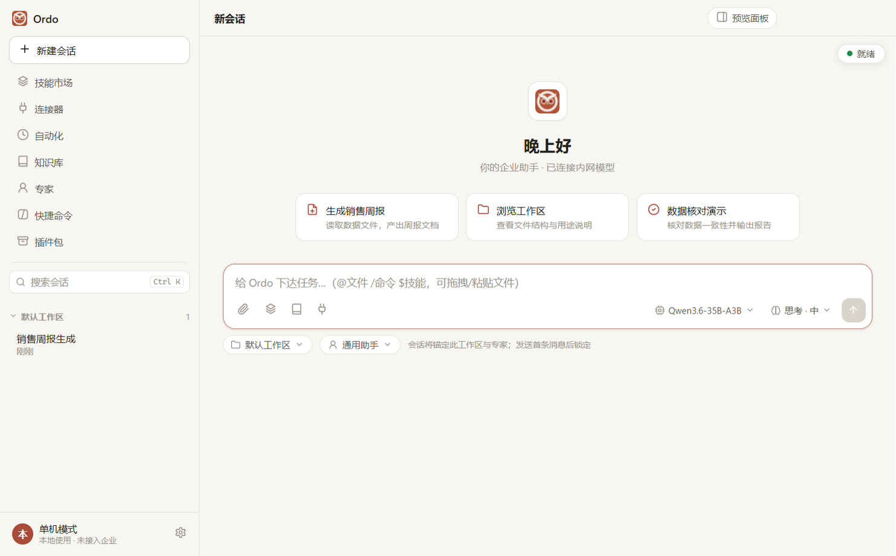
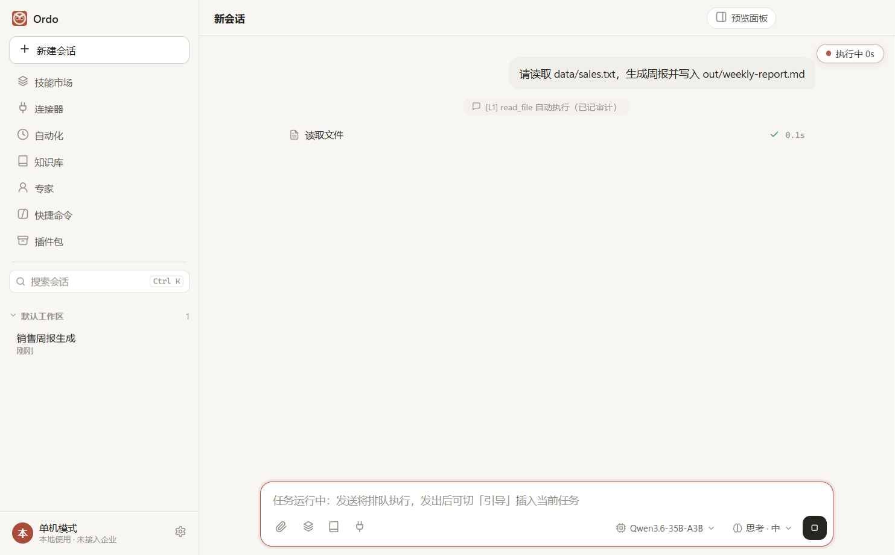
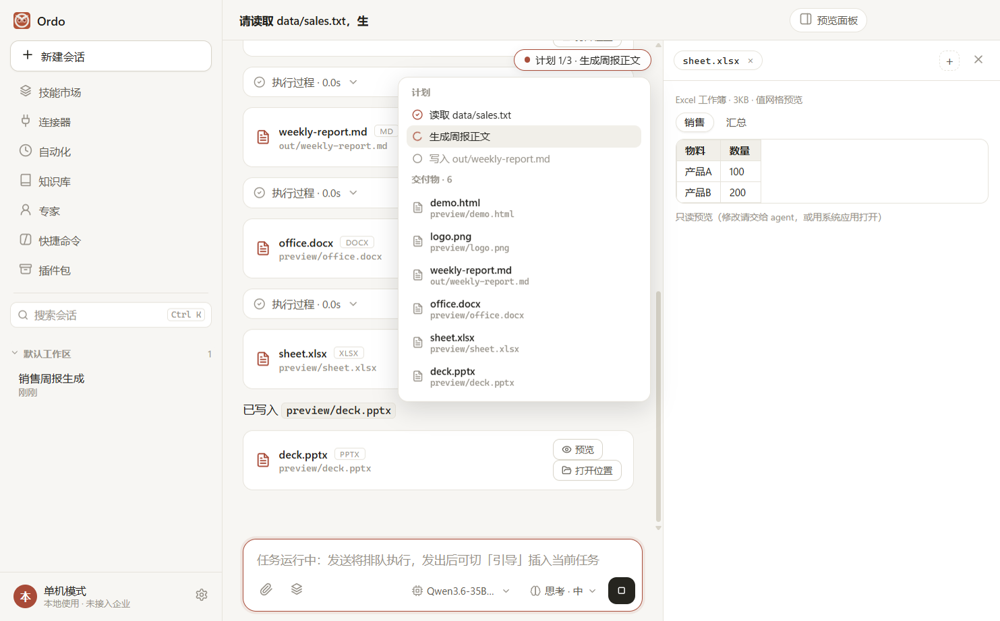

<p align="center">English · <a href="README.md">简体中文</a></p>

<div align="center">
  
  <h1>Ordo</h1>
  <p>Enterprise-grade AI agent desktop workbench · Windows<br/>
  Let employees get real work done — documents, data, browser, terminal — through natural language. Controlled, auditable, privately deployable.</p>
</div>

---

## What is Ordo?

Ordo is an agent workbench that runs on the employee's own machine: it ships real tools — files, Office (docx·pptx·xlsx), terminal, browser, OCR — while the model plans and executes multi-step tasks, delivering artifacts straight into your workspace. The name comes from Latin *ordo* ("order"): an all-capable executor that stays under control.

**Two modes:**

- **Standalone**: no server required. Full feature set locally; bring any OpenAI-compatible API (DeepSeek, Qwen, local vLLM, etc.)
- **Organization**: connect to your company's admin server — sign in with an employee ID; skills / knowledge bases / connectors / experts are provisioned per department; every action is audited; built-in forced-update channel. (The admin server is an intranet component, not part of this repository. A mock admin dataset is bundled for development and testing.)

## Core capabilities

- **Real tool execution**: workspace file operations, Office document creation & editing, PowerShell terminal, browser control (navigate / screenshot / console), image OCR (offline language packs bundled)
- **Operation levels (L1/L2/L3)**: read-only runs directly, writes require confirmation, sensitive operations are blocked — every tool call is level-gated and fenced inside authorized workspace paths
- **Skill system**: tell the assistant "turn that into a skill" — workflows proven in a conversation become reusable skill packages (SKILL.md); personal and enterprise marketplaces, tiered governance
- **Experts (roles)**: persona prompt + resource allowlist; switch business roles on one shared foundation
- **Knowledge bases**: personal KB with local retrieval; enterprise KB hosted by the admin server
- **Automation**: local scheduled tasks, unattended runs with completion notifications, artifacts logged back into sessions
- **IM channels**: DingTalk / Feishu official long connections — dispatch tasks and receive results from your phone; queue follow-ups or steer the running task mid-flight
- **Session experience**: streaming answers, grouped tool calls, thinking-level control, automatic context compaction, multi-version answer browsing, crash recovery of unfinished tasks
- **Themes**: 4 built-in themes + custom themes (icon & background overridable)

## UI

| Workbench | Session running | Preview panel |
|---|---|---|
|  |  |  |

(Screenshots show the Chinese UI.)

## Getting started

**Installer (recommended)**: grab `Ordo-0.1.0-setup.exe` (Windows 10/11 x64) from [Releases](https://github.com/Kid-FanFan/Ordo/releases). Also mirrored on [Gitee](https://gitee.com/kidzyf/ordo/releases).

**Run from source**:

```bash
git clone https://github.com/Kid-FanFan/Ordo.git
cd Ordo
npm install          # installs Electron automatically (npmmirror default; configurable)
npm start            # launch the desktop app; set an OpenAI-compatible API under Settings → Model
```

**Development & tests**:

```bash
npm run mock           # local mock model server (:8787, scripted responses, no real key needed)
npm run selftest:mock  # 267-check full suite (UI assertions + end-to-end agent flows), runs out of the box
npm run dist           # build NSIS installer → release/Ordo-<version>-setup.exe
```

> The bundled `config.mock.json` is sanitized (`model.apiKey` is a placeholder): mock tests need no real credentials. For real-model testing, put your own key in that file.

## Data & security

- All local data lives under `~/.ordo/` (sessions / workspace / skills / knowledge / audit / logs) — uninstalling removes everything
- Three-level tool gating + path fencing + full audit log
- Standalone mode keeps data on your machine (only the model API you configure receives outbound traffic)

## Tech stack

Electron + TypeScript ｜ Agent runtime on the [pi](https://github.com/earendil-works/pi) (MIT) SDK (JSONL session store / AgentHarness orchestration / steer·followUp message queue) ｜ Renderer is plain JS, no framework ｜ mock admin dataset bundled

## Repository layout

```
src/main/          Electron main process: agent assembly, IPC, IM channels, OCR, automation
src/preload/       Typed IPC bridge (contextIsolation)
src/renderer/      Chat + workbench UI (plain JS) + theme engine
tools/             Mock model server, icon pipeline, probe scripts
scripts/           Full-suite test driver (mock / real modes)
build/brand/       Brand sources + multi-size icon pipeline (npm run icon)
```

## License

[MIT](LICENSE). **Trademark notice**: the MIT grant covers the source code only. The name "Ordo" and the owl logo are trademarks of the project owner and are NOT transferred under this license; derivative works must not use them to brand, promote, or distribute their products.
